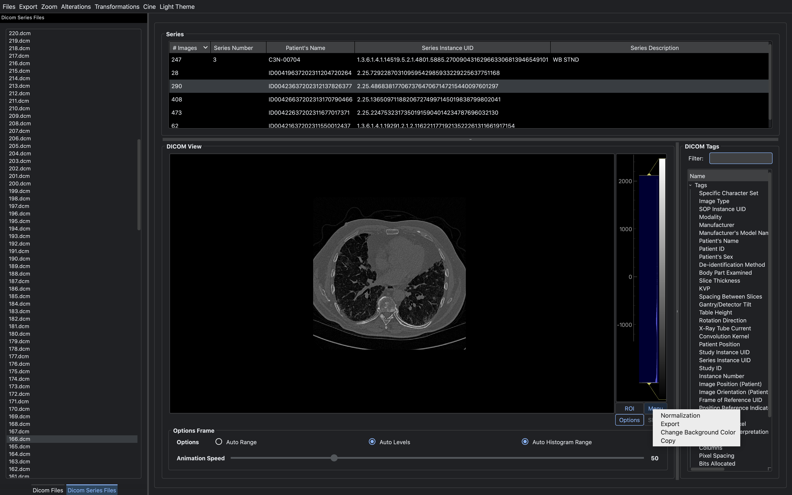
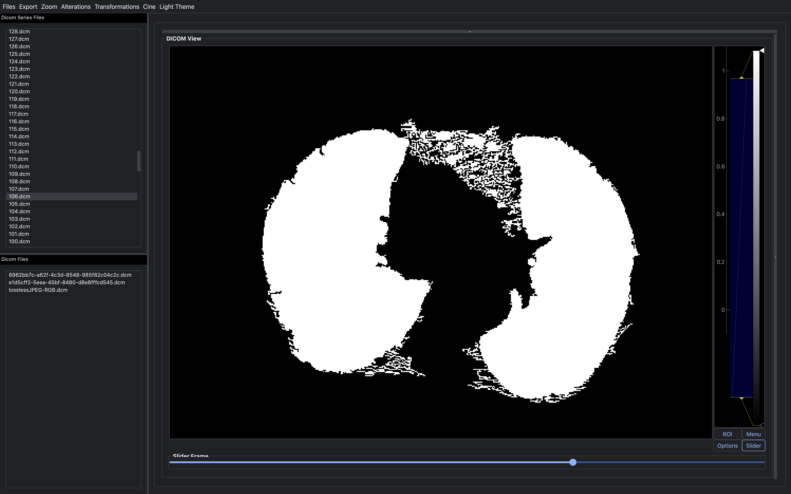
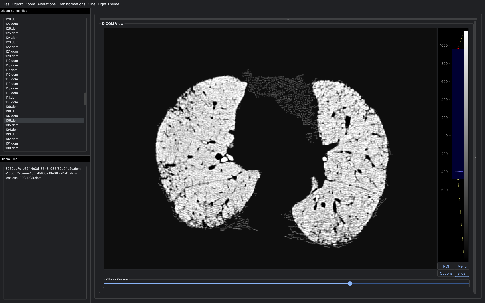

# 🏥 DicomViz

  

**DICOMViz**, a modular, expandable and lightweight portable **DICOM viewer** application written in **Python** and **Qt**. 
It allows to load and view **Dicom series**, single acquisitions and their tag data. 
The supported medical images, such as **Computed Radiography (CR)**, 
**Computed Tomography (CT)** and **Magnetic Resonance Imaging (MRI)** images, 
can be exported in different formats, copied to clipboard, viewed as animations in case of series, rotated, 
zoomed in and out and examined with other utilities. 
Even though the current state of the application is not oriented to image processing, 
additional features allow to operate with negative colors images, color maps, exposure, lungs masks and segmentation. 
The UI, written in the renowned QT Framework Python binding **Pyqt**, plays an important role, 
ensuring a fluent and user-friendly interaction thanks to a simple but customizable layout.
 

# Contents

- ⚙  [System requirements️](#system-requirements)
- 🚀 [Setup instructions](#-setup-instructions)
- 📜 [Report](report/report.pdf)
- 👨‍💻 [Usage](#-usage)
- 💡 [Features](#-features)
- 📷 [Screenshots](#-screenshots)
- 📹 [GIFs](#-gifs)
- 🤵 [Authors](#-authors)
- 📝 [License](#-license)

# System requirements

## Required software

- [Python](https://www.python.org/) 3.8 or higher
- Python modules in [requirements.txt](requirements.txt)

# 🚀 Setup instructions

## Clone the repo

    git clone https://github.com/pablogiaccaglia/DICOMViz
    cd DicomViz/

## Install required packages

From the project's directory run the following commands:

    pip install -r requirements.txt
    

# 👨‍💻 Usage

## Running

DicomViz can be run directly as a module from the project's directory:

    python -m DicomViz

# 💡 Features

| Functionality | Status |
|:-----------------------|:------------------------------------:|
| Image Visualization | [🟢](https://github.com/pablogiaccaglia/DICOMViz/tree/master/DicomViz/GUI/graphics) |
| Image Alterations |[🟢](https://github.com/Calonca/ing-sw-2021-laconca-lodari-giaccaglia/tree/master/src/main/java/it/polimi/ingsw/client/view/CLI) |
| Series Visualization | [🟢](https://github.com/Calonca/ing-sw-2021-laconca-lodari-giaccaglia/tree/master/src/main/java/it/polimi/ingsw/server/model) |
| Series Animation |[🟢](https://github.com/Calonca/ing-sw-2021-laconca-lodari-giaccaglia/tree/master/src/main/java/it/polimi/ingsw/server) |
| Image Export| [🟢](https://github.com/Calonca/ing-sw-2021-laconca-lodari-giaccaglia/tree/master/src/main/java/it/polimi/ingsw/client/view/GUI) |
| Series GIF Export |[🟢](https://github.com/Calonca/ing-sw-2021-laconca-lodari-giaccaglia/tree/master/src/main/java/it/polimi/ingsw/client/view/CLI) |
| Light / Dark Theme |[🟢](https://github.com/Calonca/ing-sw-2021-laconca-lodari-giaccaglia/tree/master/src/main/java/it/polimi/ingsw/client/view/CLI) |

# 📷 Screenshots

Image Visualization        |  Series Visualization
:-------------------------:|:-------------------------:
|  

---

Negative Image             |  Lungs mask
:-------------------------:|:-------------------------:
|  

---

Segmented lungs            |  Tags focus
:-------------------------:|:-------------------------:
|  

# 📹 GIFs

Series Gif        |  Negative Series Gif
:-------------------------:|:-------------------------:
|  

---

Change Background Color            |  Change Colormap
:-------------------------:|:-------------------------:
|  

---

Rotate & Flip DICOM Image             |  Change Theme
:-------------------------:|:-------------------------:
|  

---
# 🤵 Authors

DicomBrowser is developed and maintained by Pablo Giaccaglia <pablo.giaccaglia@mail.polimi.it>

# 📝 License

This file is part of DicomViz.

DicomViz is free software: you can redistribute it and/or modify
it under the terms of the GNU General Public License as published by
the Free Software Foundation, either version 3 of the License, or
(at your option) any later version.

DicomViz is distributed in the hope that it will be useful,
but WITHOUT ANY WARRANTY; without even the implied warranty of
MERCHANTABILITY or FITNESS FOR A PARTICULAR PURPOSE.  See the
GNU General Public License for more details.

You should have received a copy of the GNU General Public License along
with this program (LICENSE.txt).  If not, see <http://www.gnu.org/licenses/>
